# Setup Guide

## Foreword

This guide is based on [Chloe Cinders' Discord widgets guide](https://chloecinders.com/blog/discord-widgets).

If you want to create a widget from scratch instead of running this project, start there. This document focuses on using this repository to run your own GitHub activity widget, though some sections may still be useful if you are building a widget yourself.

Discord changed how widgets work recently, so you must either own the Discord application or be part of the team that owns it before you can add the widget to your profile. This setup guide therefore walks you through creating your own application.

## What You Will Set Up

- A Discord application with the widget layout
- A Discord bot token for the `/setup` command
- A Discord authorization URL used during setup
- A GitHub OAuth app for Device Flow (optional)
- A GitHub API token for fetching public profile data

## Configuration

| Key                          | Description                                                                             | Required                                      |
|------------------------------|-----------------------------------------------------------------------------------------|-----------------------------------------------|
| `Discord__Token`             | Discord bot token used by the gateway client.                                           | `True`                                        |
| `Discord__AuthorizeUrl`      | Discord authorization URL shown in the `/setup` flow.                                   | `True`                                        |
| `GitHub__Token`              | GitHub API token used for REST and GraphQL requests when a user token is not available. | `True`                                        |
| `GitHub__OAuthClientId`      | GitHub OAuth app client ID used to start Device Flow.                                   | `True` for GH OAuth2 setup. Otherwise `False` |

The names above use the environment variable format. In JSON configuration, use `:` instead of `__`, for example `Discord:Token`.

## Optional Steps

Some steps are optional and mostly relate to GitHub authentication. The app provides two widget setup flows:

- `/setup`: The original setup method, designed before Discord stopped users from adding widgets owned by other people's applications. It verifies GitHub account ownership through OAuth2 Device Flow.
- `/setup-manual`: A simplified setup method that lets you type a GitHub handle directly without proving account ownership.
  - This option allows you to impersonate any account handle. Try not to abuse it. Thanks
  - This option will be removed if Discord ever reintroduces public widgets.

## 1. Create and Set Up the Discord Application

This step creates the Discord app that makes the widget available.

- Open the [Discord Developer Portal](https://discord.com/developers/applications) and create a new application using the **New Application** button.
- Create or open the app's bot user and copy the bot token. This becomes `Discord__Token`. For now, you can save it somewhere safe. **DO NOT SHARE IT WITH ANYBODY**.
    <details><summary>Open Image reference</summary>
    <p>

    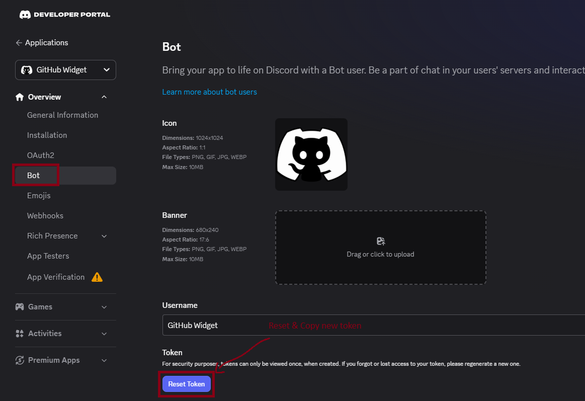

    </p>
    </details>
- Set up the app so it can be installed by a user and can register application commands. The bot registers `/setup` automatically on startup.
    <details><summary>Open Image reference</summary>
    <p>

    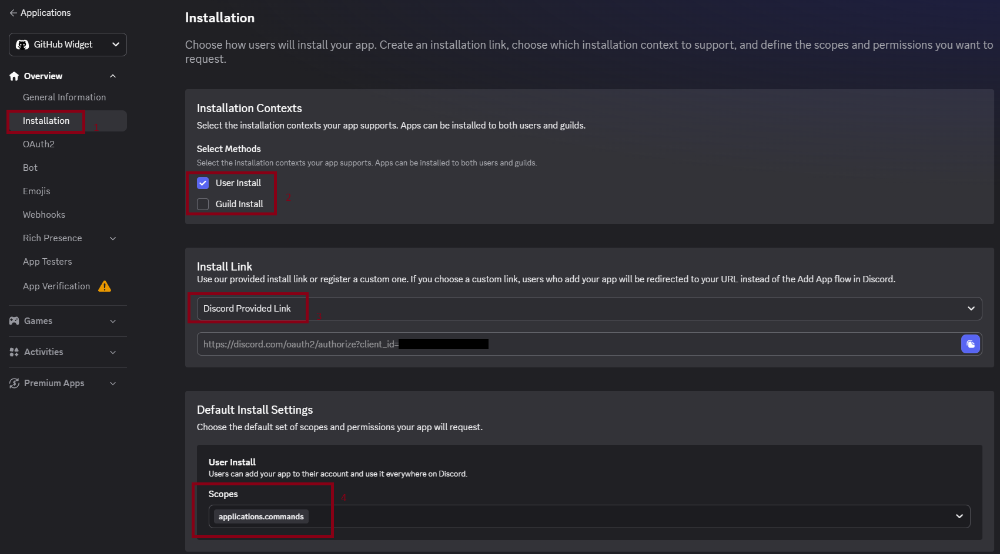

    </p>
    </details>
- Create the authorization URL that users will open during `/setup`. This URL is stored as `Discord__AuthorizeUrl`. For now, you can save it somewhere safe.
  - Select these scopes: `applications.commands`, `openid`, and `sdk.social_layer`.
  - The generated URL should look similar to this:
    ```text
    https://discord.com/oauth2/authorize?client_id=<your_app_client_id>&response_type=code&redirect_uri=<your_redirect_uri>&integration_type=1&scope=sdk.social_layer+openid+applications.commands
    ```
    
    <details><summary>Open Image reference</summary>
    <p>

    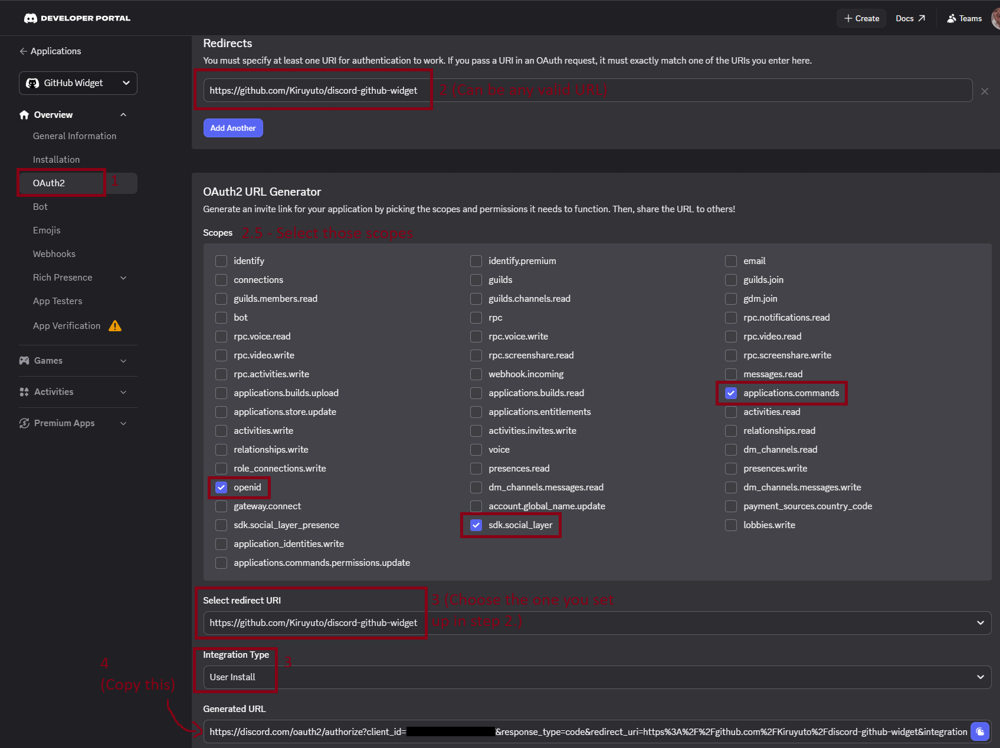

    </p>
    </details>

> [!IMPORTANT]
> Before saving the URL, change the `response_type=code` part to `response_type=token`.
>
> Open this URL yourself after creating it. This installs the application to your Discord account, which is required before slash commands can appear.
>
> Friends who want to use your widget must also open this URL after they have accepted the team invite.

## 2. Create the Widget Layout

This step walks you through creating the widget layout in the Discord Developer Portal.

- First, to access the `Widget` tab, open the developer console (`F12` on your keyboard) and paste the following code. This snippet is copied directly from Chloe's [page](https://chloecinders.com/blog/discord-widgets#setting-up-your-application-and-developer-portal).
    <details><summary>Open snippet code-block and image reference</summary>
    <p>

    ```javascript
    let _mods = webpackChunkdiscord_developers.push([[Symbol()],{},r=>r.c]);
    webpackChunkdiscord_developers.pop();

    let findByProps = (...props) => {
    for (let m of Object.values(_mods)) {
    try {
    if (!m.exports || m.exports === window) continue;
    if (props.every((x) => m.exports?.[x])) return m.exports;

            for (let ex in m.exports) {
                if (props.every((x) => m.exports?.[ex]?.[x]) && m.exports[ex][Symbol.toStringTag] !== 'IntlMessagesProxy') return m.exports[ex];
            }
        } catch {}
    }
    }

    findByProps("getAll").getAll().find(e=>e.getName() === "ApexExperimentStore").createOverride("2026-03-widget-config-editor", 1)
    ```

    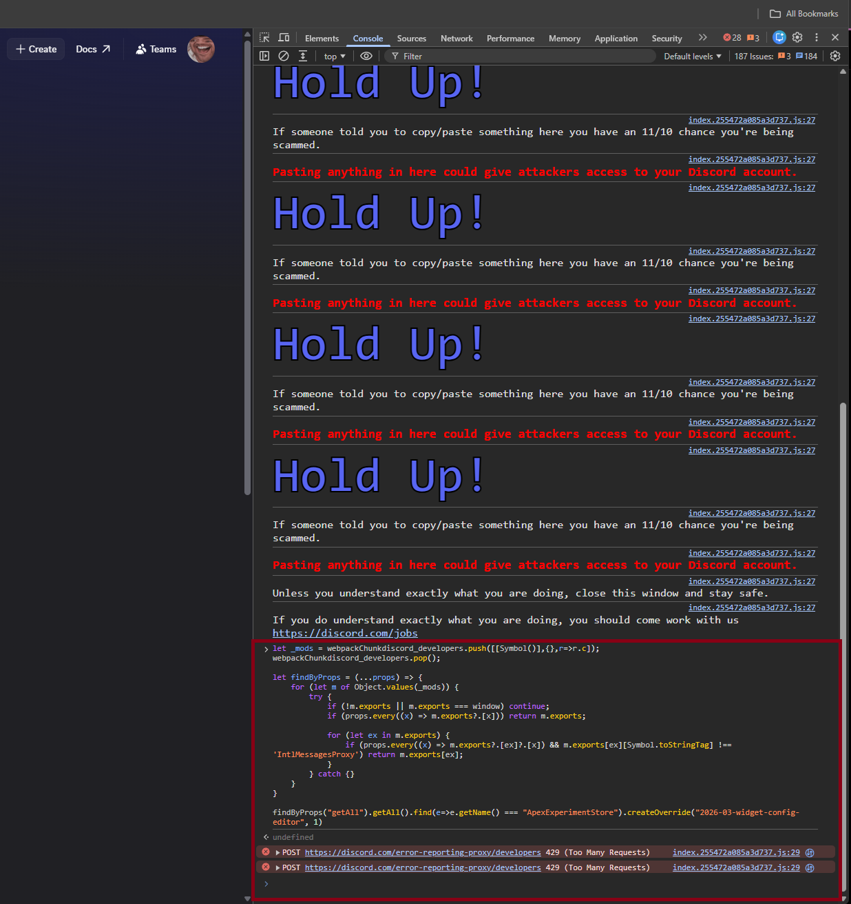

    </p>
    </details>
- After running the snippet, use the `<- Applications` button to navigate back, and then select your application again. **DO NOT REFRESH THE PAGE**.
    <details><summary>Open Image reference</summary>
    <p>

    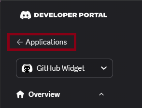
    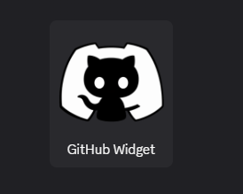

    </p>
    </details>
- If everything worked, you should see the `Widget` tab under `Games`. Open it.
    <details><summary>Open Image reference</summary>
    <p>

    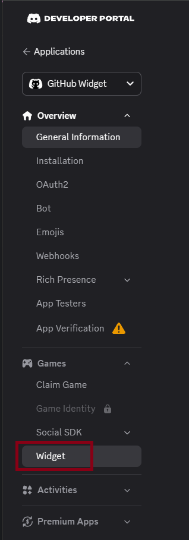

    </p>
    </details>
- The bot sends data to Discord by dynamic field name. The names must match exactly; otherwise, the widget can be installed but the data will not appear in the expected places.
  Use the tables below for this widget's layout. Copy these values if you want your widget to match the screenshots.
    <details><summary>Open dynamic field table and image reference</summary>
    <p>

    **Widget top:**
    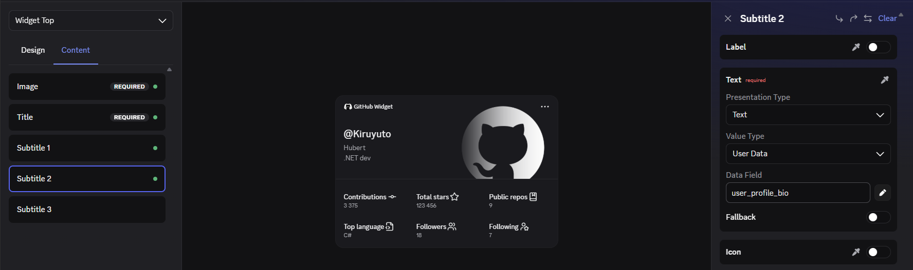

    **Widget bottom:**
    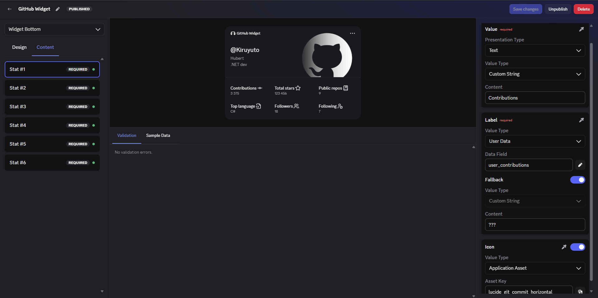

    **Add Widget Preview:**
    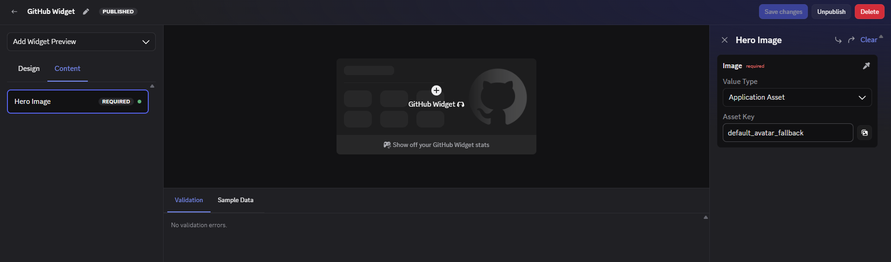

    **Mini Profile:**
    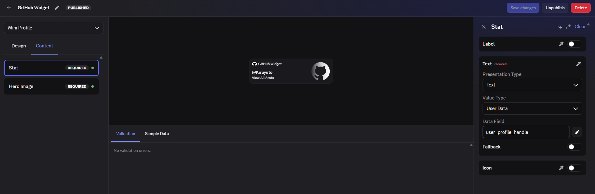

    **Activity accessory:**
    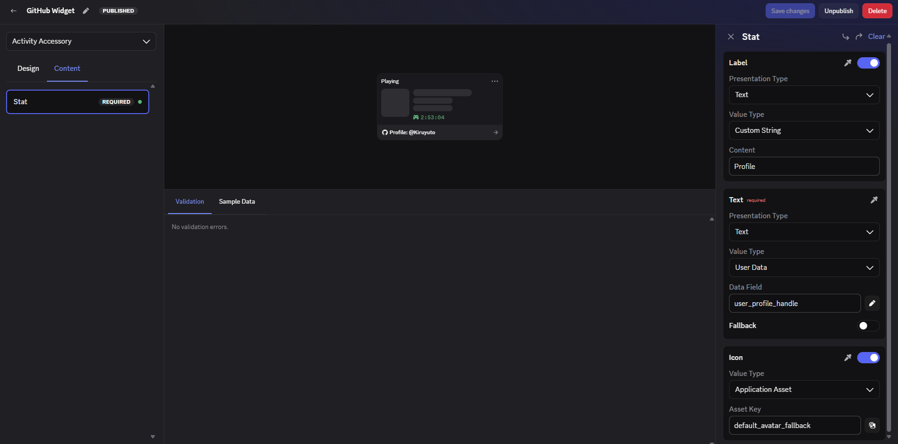

    </p>
    </details>

### Widget Top
- Design: `Hero`
- Value Type: `User Data` (Applicable to all fields)

| Content Field | Presentation Type | Data Field            | Additional Notes                     |
|---------------|-------------------|-----------------------|--------------------------------------|
| Image         |                   | `user_avatar_image`   | `Fallback` disabled                  |
| Title         | Text              | `user_profile_handle` | `Fallback` disabled                  |
| Subtitle 1    | Text              | `user_profile_name`   | `Label`, `fallback` disabled         |
| Subtitle 2    | Text              | `user_profile_bio`    | `Label`, `Fallback`, `Icon` disabled |

### Widget Bottom
- Design: `Stats Grid`
- Value_Presentation Type: `Text` (_Applicable to all fields_)
- Value_Value Type: `Text` (_Applicable to all fields_)
- Label_Value type: `User Data` (_Applicable to all fields_)
- Label_Fallback:
  - Status: `Enabled`
  - Label_Fallback_Value Type: `Custom String`
  - Label_Fallback_Content: `???`
  - _This is applicable to all fields_
- Icons:
  - Value type: `Application Asset`
  - The icons are under [Assets/lucide-*](../Assets)
  - _This is applicable to all fields_

| Content Field | Value Content   | Label_Data Field     | Icon Asset Key                 | Asset reference                                    |
|---------------|-----------------|----------------------|--------------------------------|----------------------------------------------------|
| Stat #1       | `Contributions` | `user_contributions` | `lucide-git_commit_horizontal` | [LINK](../Assets/lucide-git_commit_horizontal.png) |
| Stat #2       | `Total stars`   | `user_stars_total`   | `lucide-star`                  | [LINK](../Assets/lucide-star.png)                  |
| Stat #3       | `Public repos`  | `user_public_repos`  | `lucide-book_marked`           | [LINK](../Assets/lucide-book_marked.png)           |
| Stat #4       | `Top language`  | `user_top_language`  | `lucide-file_code2`            | [LINK](../Assets/lucide-file_code2.png)            |
| Stat #5       | `Followers`     | `user_followers`     | `lucide-users`                 | [LINK](../Assets/lucide-users.png)                 |
| Stat #6       | `Following`     | `user_following`     | `lucide-star`                  | [LINK](../Assets/lucide-star.png)                  |

### Add Widget Preview
- Design: `Hero`

| Content Field | Value Type        | Data Field                | Additional Notes                                                                                                                     |
|---------------|-------------------|---------------------------|--------------------------------------------------------------------------------------------------------------------------------------|
| Hero Image    | Application Asset | `default_avatar_fallback` | I set it to the `GitHub_Invertocat_White` icon. <br/>You can get it from GitHub's [Brand Book page](https://brand.github.com/foundations/logo) |

### Mini Profile
- Design: `Hero Stat`

| Content Field | Presentation Type | Value Type | Data Field            | Additional Notes                                     |
|---------------|-------------------|------------|-----------------------|------------------------------------------------------|
| Stat          | Text              | User Data  | `user_profile_handle` | `Label`, `Icon` disabled                             |
| Hero Image    |                   | User Data  | `user_avatar_image`   | `Fallback` enabled, set to `default_avatar_fallback` |

### Activity Accessory
_(This layout is currently unused, but it is configured for completeness.)_
- Design: `Stat`

| Content Field | Field Type | Presentation Type | Value Type        | Content | Data Field            | Asset Key                 | Additional Notes    |
|---------------|------------|-------------------|-------------------|---------|-----------------------|---------------------------|---------------------|
| Stat          | Label      | Text              | Custom String     | Profile |                       |                           |                     |
| Stat          | Text       | Text              | User Data         |         | `user_profile_handle` |                           | `Fallback` disabled |
| Stat          | Icon       |                   | Application Asset |         |                       | `default_avatar_fallback` |                     |

## 3. Create the GitHub OAuth App (Optional)

This step is optional if you use the simplified setup. For more detail, see [Optional Steps](#optional-steps).

- Open GitHub's [developer settings](https://github.com/settings/applications/new) and create a new OAuth app.
- The application uses GitHub OAuth Device Flow, so the callback URL is not used by this project at runtime. GitHub still requires one when creating an OAuth app, so you can use the same URL you created in [Step #1](#1-create-and-set-up-the-discord-application).
- Enable Device Flow in the OAuth app settings, then copy the app's `Client ID`. This becomes `GitHub__OAuthClientId`.
- The client secret is not used by this project.
    <details><summary>Open Image reference</summary>
    <p>

    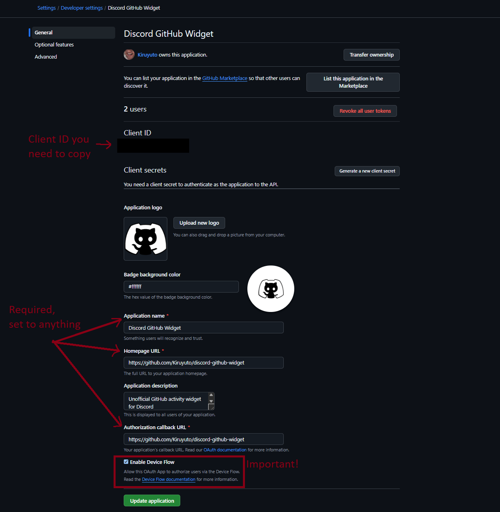

    </p>
    </details>


## 4. Create a GitHub API Token

This step walks you through creating a classic PAT.

This token is used by the bot for GitHub REST and GraphQL requests when a temporary user token is not available, or always when using simplified setup.

- Navigate to [Developer Settings/Tokens](https://github.com/settings/tokens/new) to create a new classic access token.
- **You do not need to select any scopes**. The app accesses only publicly available data.
- Choose an expiration date that works for you. Just remember to rotate the token once it expires.
- Save the newly created token somewhere safe. This will be used as the `GitHub__Token` configuration key.
- A properly configured token should look like this:
    <details><summary>Open Image reference</summary>
    <p>
    
    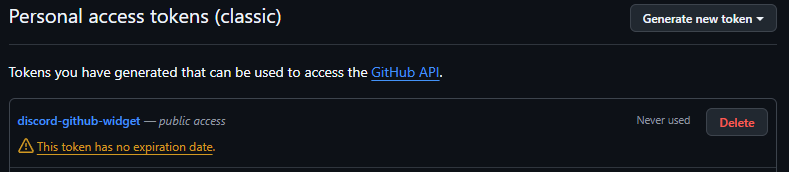
    
    </p>
    </details>


## 5. Run The App

There are multiple ways to run the app, but the easiest path is Docker Compose. In the repository root, you can find two compose files:

- [`compose.yaml`](../compose.yaml): Local development sandbox. It builds the bot from source and runs PostgreSQL with disposable development credentials.
- [`compose.Prod.yaml`](../compose.Prod.yaml): Production-oriented compose file. It pulls the latest image from GitHub registry and requires real configuration.

For most users, I recommend `compose.Prod.yaml` because it does not require cloning or building the project locally.

- For local development, clone the repository and use [`compose.yaml`](../compose.yaml).
- Create a `.env` file.
  - Either copy the example file:
      ```bash
      cp .env.example .env
      ```
  - Or copy-paste the [.env.example](../.env.example) content.
- Open the new `.env` file and fill in the real values.
  - `Discord__Token`, `Discord__AuthorizeUrl`, and `GitHub__Token` are required by `compose.yaml`, so the bot will not start without them.
  - You do not need to set `Database__ConnectionString` or PostgreSQL values for local development. Compose builds the connection string automatically and uses disposable PostgreSQL credentials.
- Start the local development stack:
    ```bash
    docker compose up --build
    ```
- If you want to use a different env file for local development, pass it explicitly, e.g:
    ```bash
    docker compose --env-file ./Production.env up --build
    ```
- For production, download [`compose.Prod.yaml`](../compose.Prod.yaml) and create a `.env` file next to it.
- Do not leave the PostgreSQL values empty when using `compose.Prod.yaml`.
- For simplified setup, leave `GitHub__OAuthClientId` commented out and use `/setup-manual`. For the OAuth setup path, complete [Step #3](#3-create-the-github-oauth-app-optional), uncomment `GitHub__OAuthClientId`, and set it to your GitHub OAuth app client ID.
- You do not need to set `Database__ConnectionString` in the production `.env`. Compose builds it automatically so the bot connects to the `postgres` service.
- Start the production compose file:
    ```bash
    docker compose -f ./compose.Prod.yaml up -d
    ```
- The services will keep running in the background. While they are running, the bot refreshes widget data for you and any other users who set up your widget about every 6 hours.
- If you want to stop the services, use:
  ```bash
  docker compose down
  # Or delete the PostgreSQL data volume too:
  docker compose down --volumes
  ```

## 6. Add the Widget to Your Discord Profile

- In Discord, run `/setup` for GitHub verification or `/setup-manual` for the simplified flow.
- The bot will send an ephemeral setup panel. Follow the instructions it provides.
- After setup succeeds, the bot shows a success message. Restart Discord if the widget does not appear immediately. Then open your profile and use the `Add Widget` button.

## 7. Let Friends Use Your Widget

Discord only lets users add widgets from applications they own or help manage. If you want friends to use your widget, move the Discord application into a team and add them to that team.

- Open the [Discord Developer Portal](https://discord.com/developers/applications).
- Create a team if you do not already have one.
- Transfer your widget application to that team.
- Invite each friend to the team and wait until they accept the invitation.
- Assign them the `Developer` or a higher role.

After that, they should be able to run the setup command and add the widget to their own Discord profile.

> [!CAUTION]
> **Only invite people you trust**.
> 
> Team members with elevated roles can manage parts of the Discord application, so do not use this as a public access mechanism.

---

## Troubleshooting

### `/setup` or `/setup-manual` Does Not Show Up

Restart the bot and Discord.
If that does not help, confirm that you selected the correct application scopes.
When the bot starts, you should also see an informative log line (_X stands for the number of commands_):
```log
X application command(s) registered.
```

### GitHub Authorization Fails

This only applies to `/setup`.
Make sure Device Flow is enabled on the GitHub OAuth app and that `GitHub__OAuthClientId` is uncommented in `.env` and set to the client ID from that app.
The GitHub code expires after 15 minutes, so rerun `/setup` if the flow times out.

### Widget Data Is Missing

Confirm the widget dynamic field names match the table in this guide exactly. Also confirm that you own the Discord application, or that you are part of the team that owns it.
