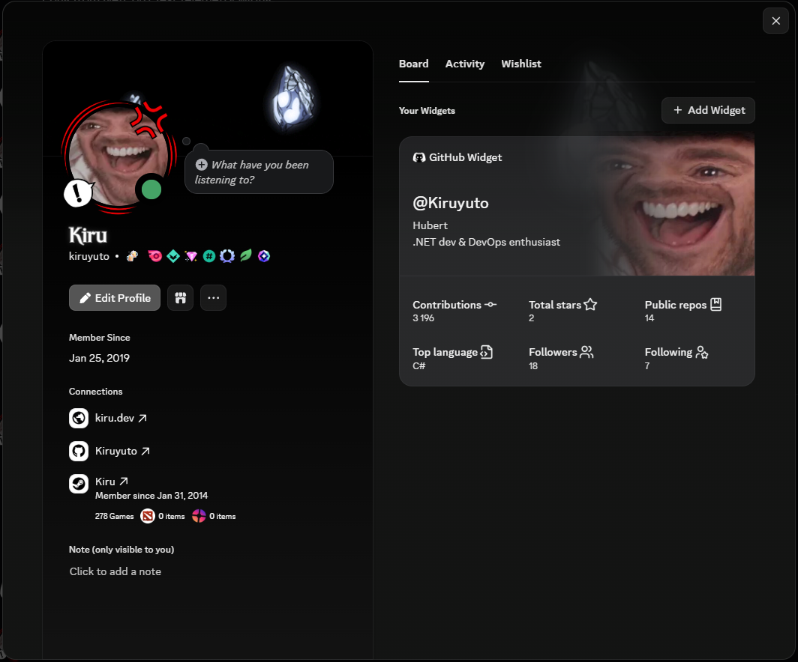
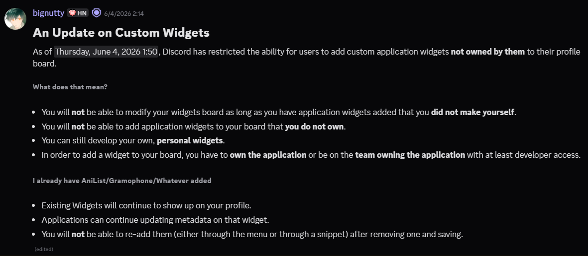

<div align="center">
  

  <h1>Discord GitHub Widget</h1>

  <p>Unofficial GitHub activity widget for Discord</p>

  <p>
    <a href="https://github.com/Kiruyuto/discord-github-widget/actions/workflows/ci.yml">
      
    </a>
    
    
  </p>
</div>

## Preview

<table>
  <tr>
    <td width="68%">
      
    </td>
    <td width="32%">
      
    </td>
  </tr>
</table>

## What It Does

Fetches public GitHub profile stats and displays them in a Discord profile widget.

This particular widget shows:

- GitHub handle, avatar, display name, and bio
- Total contributions
- Total stars across owned repositories
- Public repository count
- Top repository language
- Followers and following counts

## Add It to Your Profile

Discord changed how widgets work recently, so you must either own the application or be part of the team that owns it before you can add the widget to your profile.

That means you cannot simply authorize someone else's hosted application and use it directly.  
**The good news is you can follow [Setup.md](./Docs/Setup.md) to create your own Discord application.**

For more context, see the Discord Previews message below:
[Discord Previews announcement](https://discord.com/channels/603970300668805120/983619277531779082/1511885826408189952)



## Development

Restore, build, and test from the repository root:

```bash
dotnet restore
dotnet build --no-restore
dotnet test --no-restore --no-build
```

Run the same formatting check used by CI:

```bash
# Check formatting:
dotnet format --no-restore --verbosity diagnostic --severity info
# Verify formatting:
dotnet format --no-restore --verbosity diagnostic --severity info --verify-no-changes
```
